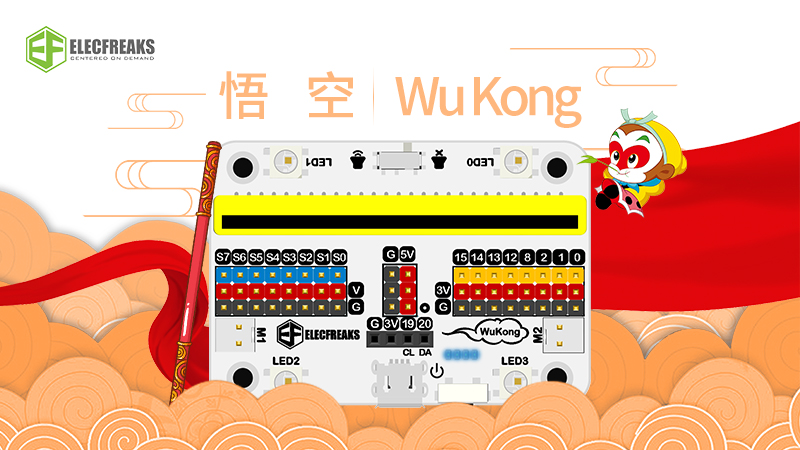

# Wukong expansion board



This library is designed to drive Wukong expansion board , You can get Wukong board here.

[https://www.elecfreaks.com/store/Wukong.html](https://www.elecfreaks.com/store/Wukong.html)

## Code Example
```JavaScript
let speed = 0
let flag = false
WuKong.setlightMode(WuKong.lightMode.breath)
flag = true
basic.forever(function () {
    if (speed == 100) {
        flag = false
    } else if (speed == -100) {
        flag = true
    }
    if (flag) {
        speed += 1
    } else {
        speed += -1
    }
    WuKong.setmotorSpeed(WuKong.motorList.M1, speed)
    WuKong.setmotorSpeed(WuKong.motorList.M2, speed)
})
```
## Supported targets
for PXT/microbit

## License
MIT
